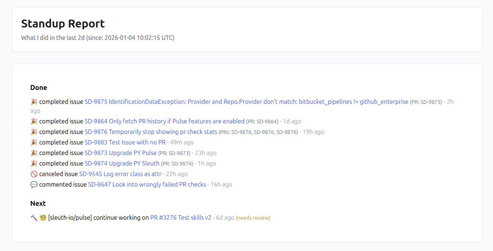
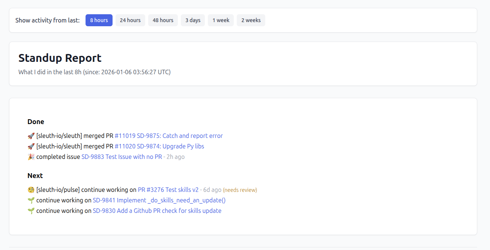

# Construct Daily Standup Report

Looks at my last PRs and tickets and collects notes on the fly and create a Slack report with the click of a button.


## Quick Start

1. **Setup Configuration**: Create a `.env` file in the project root:
```bash
GH_API_TOKEN=your_github_token_here
GH_LOGIN=your_github_username
GH_USERNAME=...
LINEAR_TOKEN=...
LINEAR_EMAIL=...
```

Get your [API access token from GitHub](https://github.com/settings/tokens).

Get your [Personal API key from Linea](https://linear.app/settings/account/security).

## Examples




