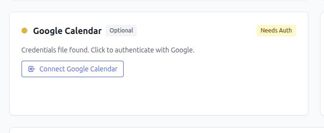
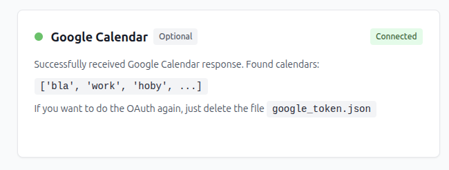

# Construct Daily Standup Report

Checks **GitHub** and **Linear** for PRs and issues I've worked on in the last 24h (or more or less) and creates a simple overview of "Done" and "Next" work items.


## Quick Start

1. **Setup Configuration**: Create a `.env` file in the project root:
    ```bash
    GH_API_TOKEN=your_github_token_here
    GH_LOGIN=your_github_username
    GH_USERNAME=...
    LINEAR_TOKEN=...
    LINEAR_EMAIL=...
    ```

    Get your [API access token from GitHub](https://github.com/settings/tokens).
    Get your [Personal API key from Linear](https://linear.app/settings/account/security).

2. **Start** server with `make up`.

3. **Open [http://localhost:2300/report](http://localhost:2300/report)**. 
   
   It should print out your report. If it doesn't, check the [http://localhost:2300](http://localhost:2300) page where we check if your API tokens work. 
    
    No PR or issue data is stored locally. The report makes GQL requests every time the page is loaded.


## Optional Extended Configuration

Optional integrations to enhance your standup report.

### Google Calendar

Google unfortunately doesn't offer a simple token-based API access, not even a personal API token. They only support OAuth. On top of that they have a whole Google-Cloud-Project infrastructure with 20+ steps, so that is what we have to do to get a list of meetings we were on.


_I'm paraphrasing this guide: [Python quickstart](https://developers.google.com/workspace/calendar/api/quickstart/python)._

#### Requires OAuth 2.0 setup:

1. Create a project in the [Google Cloud Console](https://console.cloud.google.com/projectcreate)
2. [Enable the Google Calendar API](https://console.cloud.google.com/flows/enableapi?apiid=calendar-json.googleapis.com) for your project
3. Configure [OAuth  in Branding](https://console.cloud.google.com/auth/branding) (set to "External", add yourself as a test user)
4. Authorize credentials for a desktop application in [Google Auth platform > Clients](https://console.cloud.google.com/auth/clients). Create new client and choose "Desktop app" type. The newly created credential appears under "OAuth 2.0 Client IDs."
5. Download the credentials JSON and save it as `credentials.json` in the project root. The code expects the name and the name and path to be exactly that.

I've set this up to be forever in test mode. But if you have a working OAuth access, use that! No need to create a whole new OAuth flow just for this little script.

#### How it works

Flow:
1. User downloads credentials.json from Google Cloud Console
2. Home page shows "Connect Google Calendar" button
   
3. Clicking it redirects to Google's OAuth consent screen
4. After consent, callback saves token to `google_token.json`
5. Home page shows green "Connected" status
   


## Local Development

**Python** is managed by 
- [uv](https://docs.astral.sh/uv/getting-started/installation/).

**JavaScript is optional**, it is used only for formatting JS files only: 
- [Node.js](https://nodejs.org/)

### Setup

1. Install dependencies (Python via uv, JS via npm):
   ```bash
   make install
   # OR if you want just Python, no JS:
   make install-py
   ```

2. Run the server:
   ```bash
   make up
   ```

### Linting & Formatting

```bash
# Python (ruff, black, mypy) and JavaScript (prettier)
make lint
```

## Examples of reports:


